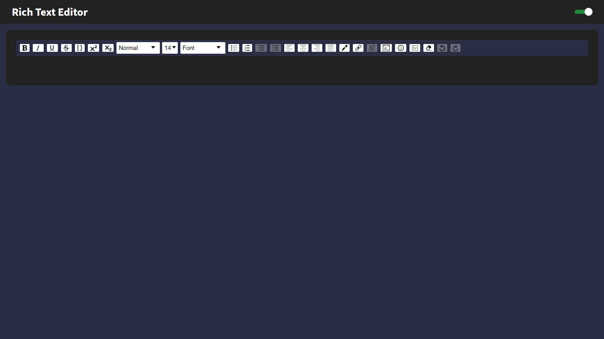
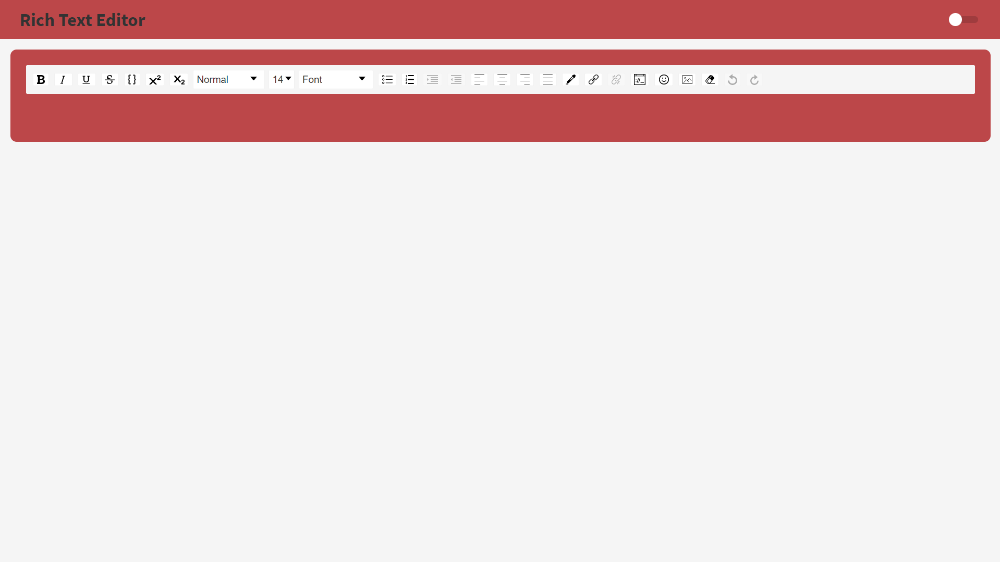

<div align="center" id="top"> 
  
</div>

<hr/>
<br>

## About

This application aims to edit the text entered by the user, where all changes are applied in real time.

## Screenshots

<div align="center"> 
  
</div>
<br/>
<br/>
<div align="center"> 
  
</div>

## Features

- Text and Image Styles.
- Light and dark mode selector (state in local storage).

## Technologies

The following tools were used in this project:

- [React](https://pt-br.reactjs.org/)
- [TypeScript](https://www.typescriptlang.org/)
- [Polished](https://polished.js.org/)
- [Styled Componensts](https://styled-components.com/)

## Requirements

Before starting 🏁, you need to have [Git](https://git-scm.com) and [Node](https://nodejs.org/en/) installed.

## Starting

```bash
# Clone this project
$ git clone https://github.com/trpiano/RichTextEditor

# Access
$ cd RichTextEditor

# Install dependencies
$ yarn

# Run the project
$ yarn start

# The server will initialize in the <http://localhost:3000>
```

Made with 💜 by <a href="https://github.com/trpiano" target="_blank">Timoteo Piano</a>

&#xa0;

<a href="#top">Back to top</a>
